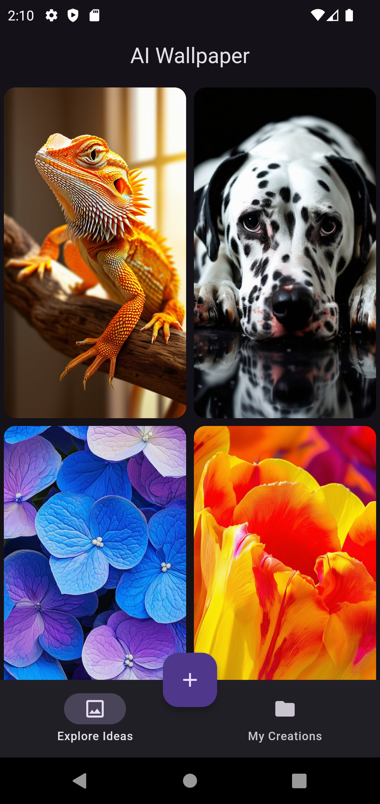
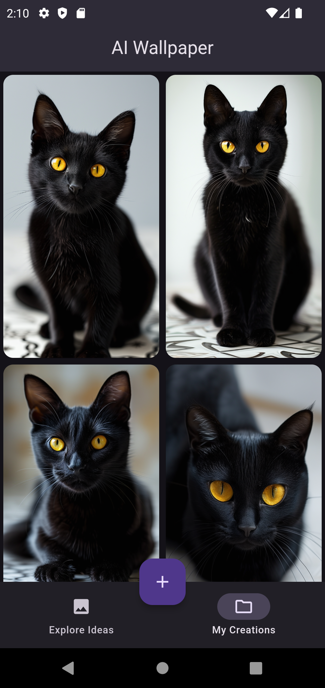
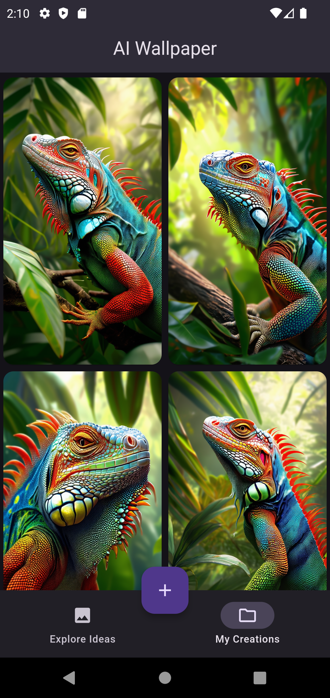
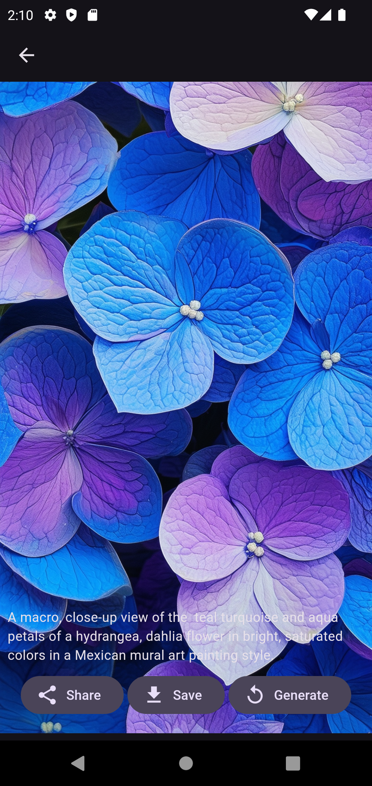
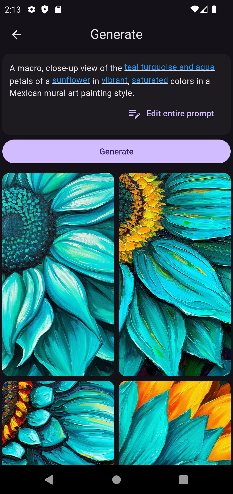

# AI Wallpaper Generator 🎨✨

A premium, modern Flutter application that leverages **Stability AI (Stable Diffusion 3)** to generate gorgeous, high-resolution mobile wallpapers on the fly. Built with **GetX** state management, routing, and an **Isar Database** cache layer for ultra-smooth performance.

---

## 📱 Screenshots

<p align="center">
  
  
  
</p>

<p align="center">
  
  
  
</p>

---

## ✨ Features

- **Text-to-Image Generation**: Harnesses **Stable Diffusion 3 (sd3-medium)** via Stability AI to generate tailored mobile wallpapers from text descriptions.
- **Aspect Ratio & Templates**: Offers options to customize aspect ratios (e.g., `9:16` for mobile screens) and use beautifully designed presets.
- **Local Asset Bootstrapping**: Loads a curated list of high-quality local wallpapers into the local database on first run.
- **Offline Cache**: Powered by **Isar Database**, caching generated wallpapers and local presets to ensure instant load times and offline viewing.
- **Download & Share**:
  - Save wallpapers directly to your device's image gallery.
  - Share your stunning creations with friends via native system sheets.
- **Beautiful Dark Theme**: A sleek, premium dark-mode user interface designed to make the vibrant wallpapers pop.

---

## 🛠️ Technology Stack

- **Framework**: [Flutter](https://flutter.dev) (iOS & Android)
- **State Management & Routing**: [GetX](https://pub.dev/packages/get)
- **Database**: [Isar](https://isar.dev) (NoSQL local database)
- **AI Integration**: [Stability AI HTTP API](https://platform.stability.ai/) (Stable Image Ultra / SD3)
- **Utilities**:
  - `image_gallery_saver` (Saving images to device gallery)
  - `share_plus` (Social sharing)
  - `shimmer` (Smooth loading states)
  - `gap` (Clean UI layout spacing)

---

## 🚀 Getting Started

### 📋 Prerequisites

Before running the project, ensure you have the following installed:
- [Flutter SDK](https://docs.flutter.dev/get-started/install) (`>= 3.4.1`)
- A [Stability AI API Key](https://platform.stability.ai/)

### 🔑 API Configuration

This project expects your Stability AI API key to be provided at compilation time using Dart define. 

To run or build the app, replace `YOUR_API_KEY` with your actual Stability AI key:

```bash
flutter run --dart-define=STABILITY_APIKEY=YOUR_API_KEY
```

To build an APK:

```bash
flutter build apk --release --dart-define=STABILITY_APIKEY=YOUR_API_KEY
```

### 📦 Installation

1. **Clone the repository:**
   ```bash
   git clone https://github.com/anoochit/gen_wallpaper.git
   cd gen_wallpaper
   ```

2. **Install dependencies:**
   ```bash
   flutter pub get
   ```

3. **Generate Isar Database Schema files:**
   ```bash
   flutter pub run build_runner build --delete-conflicting-outputs
   ```

4. **Run the application:**
   ```bash
   flutter run --dart-define=STABILITY_APIKEY=YOUR_API_KEY
   ```

---

## 📁 Project Structure

```
lib/
├── app/
│   ├── bindings/     # GetX bindings for dependency injection
│   ├── controllers/  # App state and logic controller (Isar, Stability AI, Gallery, Share)
│   ├── data/         # Mock/Local wallpapers list data
│   ├── models/       # Database schemas (Isar Collections) and model definitions
│   ├── modules/      # UI Views and Controllers (Home, Generate, View Image)
│   ├── routes/       # GetX routing definitions & navigation paths
│   ├── services/     # API integrations (Stability AI) & DB Initialization
│   └── widgets/      # Shared/Reusable custom UI widgets
└── main.dart         # App entrypoint & initializers
```

---

## 📄 License

This project is configured for private use (`publish_to: none` in `pubspec.yaml`). All assets and code are owned by their respective creators.
